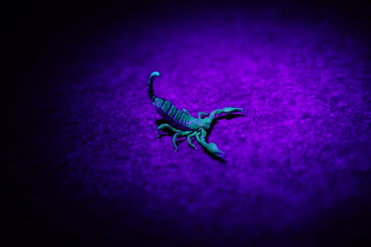
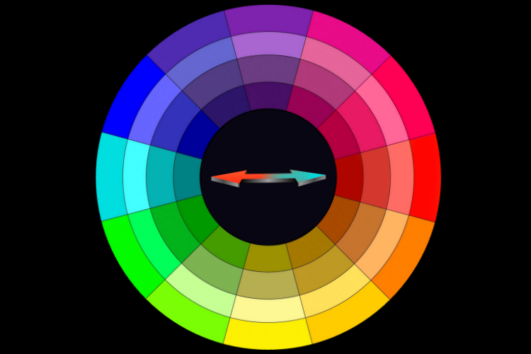

#
# Scrypto mascot Stan prop
# 

-------------------------------------------------------------------------------------------
## Index  
-------------------------------------------------------------------------------------------	
>
> [Part_1](#part_1) . Premise
> 
> [Part_2](#part_2) . Scorpion
> 
> [Part_3](#part_3) . Color
>
> [Part_4](#part_4) . Name
>
> [Part_5](#part_5) . Content

#
## Premise 
# 
-----------------------------------------------------------------------  
As emerged from a quick and informal survey on Twitter, launched by Beem(https://github.com/beemdvp), elected choice among Radix community, 
represented by a small number of participants, was clearly oriented towards the scorpion, as mascot for the Scrypto programming language.
The scorpion is the protagonist of one of the first NFT collections as well as one of the most popular, to date, of the Radix ecosystem, 
so it doesn't surprise me too much the character's choice by the survey partecipants fell on it.
Here you can examine my proposal, the image was elaborated starting from some handcrafted sketches posted on Twitter that seemed 
to have been appreciated at publication's time. 

[Back Up](#index)

#
## Scorpion 
# 
----------------------------------------------------------------------- 
In a cultural landscape, the scorpion is symbol of change, an inner driving force that pushes us beyond our limits and boundaries.
Many cultures consider it an animal with a dual function: it is capable of killing with the lethal venom it releases from its tail, 
but it can also cure thanks to the healing power of the poison itself. 
Same way Scrypto may result lethal for attackers as well as a panacea for regular DeFi users  
due to it asset-oriented paradigm and enhanced secutity features, pushing the game further to the next level.

On a medecine note nowadays pharmacological treatment as well as new drugs experimentation based upon cuban blue scorpion venom, locally 
known as "alacran azul", are implemented in different countries as deemed capable to cure different type of disease.

[Back Up](#index)

#
## Color 
# 
-----------------------------------------------------------------------

### Scorpions glow in the dark

If you take a walk in the desert on a cloudless full moon night, you may notice the UV rays from the moonlight make scorpions glow a cerulean blue hue, 
breaking the dark around them, same way Scrypto may turn on the light in a dark landscape of weak smart contract programming languages we're sadly 
dealing with nowadays. 

### Complementary hues

Scrypto exploits the underlying Rust environment for its functioning, thus enhancing its peculiarities at the same time.
Rust takes its name from an oxidative stage of iron characterized by a warm vermilion/red-orange hue, opt for a complementary color seemed 
like a natural choice to me. Still playing around with name meaning, I thinked at sulphate of copper, an oxidative stadium of the latter metal, 
characterized, like some of his others basic carbonates, by a cold Cerulean blue/teal hue, as a viable choice. 
Copper and iron, by the way, also form an electrochemical couple.
Cerulean blue / teal together with vermilion / red orange form a complementary colors couple, once mutually leveraged by placing them side by side 
they enhance shining bright from each other, resembling Scrypto whom is designed to shine leveraging Rust.

[Back Up](#index)

#
## Name 
# 
----------------------------------------------------------------------- 
The name Stan emerged from the aforementioned Twitter's survey as a tribute to the author of the overmentioned NFT collection.
However the assonance with the term "stain" still surprisingly sends me back to the Rust universe again.

[Back Up](#index)

#
## Content 
# 
----------------------------------------------------------------------- 
Repo provides some HD images of Stan portrayed in different attitudes as well as related icons in different formats.

[Back Up](#index)

